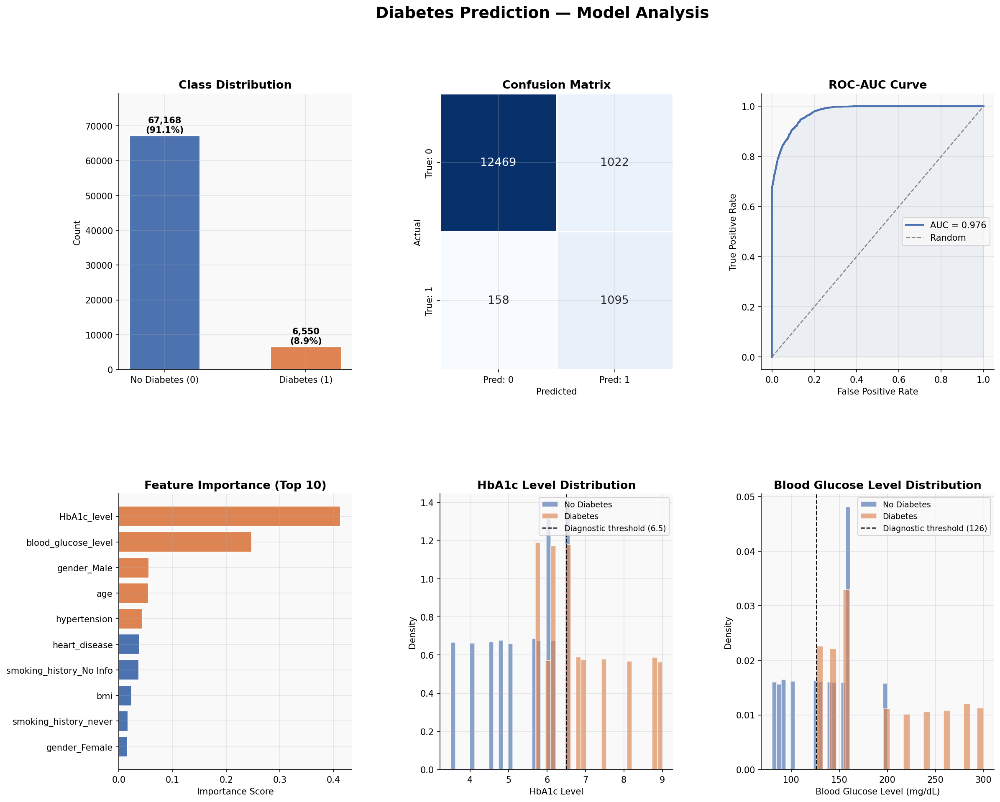

# Diabetes-classification
Diabetes prediction model using XGBoost

# Diabetes Prediction: Classification Project

Binary classification model to predict diabetes based on patient medical and demographic data.

## Task

Given a set of patient features, predict whether a patient has diabetes (`1`) or not (`0`).

## Dataset

| Split | Rows | Columns |
|-------|------|---------|
| Training | 73,718 | 10 |
| Test | 26,146 | 9 |

**Features:**
- `age` - patient age
- `gender` - Female / Male / Other
- `bmi` - body mass index
- `hypertension` - 0 or 1
- `heart_disease` - 0 or 1
- `smoking_history` - never / former / current / not current / ever / No Info
- `HbA1c_level` - glycated hemoglobin level
- `blood_glucose_level` - blood glucose level

**Target:** `diabetes` (0 / 1) - class imbalance 10:1

## Model

- **Algorithm:** XGBoost Classifier
- **Preprocessing:** StandardScaler for numeric features, OneHotEncoder for categorical
- **Class imbalance:** handled via `scale_pos_weight`

## Results

| Metric | Class 0 | Class 1 |
|--------|---------|---------|
| Precision | 0.99 | 0.52 |
| Recall | 0.92 | 0.87 |
| F1-score | 0.95 | 0.65 |

**Accuracy:** 0.92 | **Cross-Validation Accuracy:** 0.92 ± 0.003

## Submission Format

`predictions.csv` - two columns: `ID` and `prediction` (0 or 1, not probabilities)

## Project Structure

```
├── Classification.ipynb   # main notebook
├── training_data.csv          # labeled training data
├── test_data.csv              # unlabeled test data
├── predictions.csv            # submission file (ID + prediction)
└── README.md
```

## Requirements
```
pandas
numpy
scikit-learn
xgboost
```
## Visualizations

